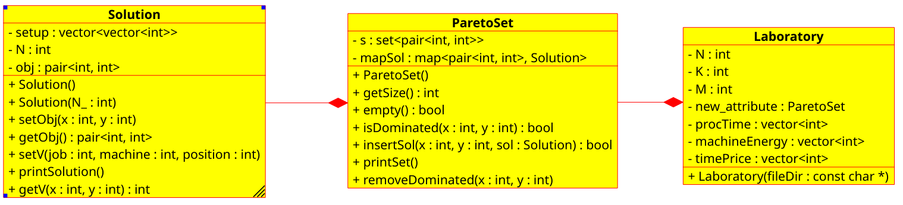

# Algorithms

Algorithms and metaheuristics created to solve the bi-objective problem.

## ConstructiveHeuristic() pseudocode

```
sort Jobs in decreasing order of Processing Time
sort Machines by increasing Energy Consumption

for each Makespan from MAX to MIN:  
    generate preffix sum table (of available time slots)  
    S = empty solution  
    for each ordered Job:  
        Find best place to insert (min cost)  
        Insert job in S(position, machine)  
    save S in ParetoSet  
    decrease Makespan by 1  
```


# Class Diagram

<p align="center">

</p>


# Pareto

Algorithms to specifically handle bi-objective Pareto Solutions:

    ParetoSet:  Use a set structure to store Pareto's objectives and a map to store solutions. (Main, fastest)
    ParetoVec:  Use a vector structure to store all solutions and apply filtering in the end. (Sandbox folder)
    ParetoSqrt: Use a vector structure and apply filtering every time its buffer hits size sqrt(MAXN), being MAXN = max solutions. (Sandbox folder)
    
    
